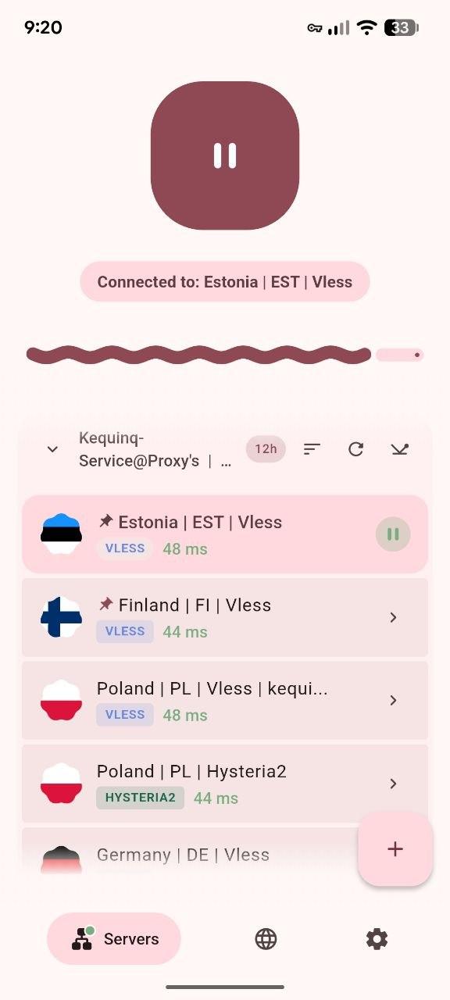
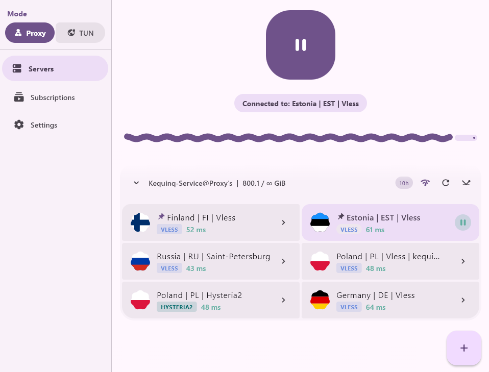

<p align="center">
  
</p>

<h1 align="center" id="keqdis">KEQDIS</h1>

<p align="center">
  <strong>English</strong> · <a href="#русский">Русский</a>
</p>

<p align="center">
  Proxy and VPN client: subscriptions, standalone configs, routing.<br>
  Android · Windows · Linux
</p>

<p align="center">
  <a href="https://github.com/Lemonochka/keqdroid/releases"></a>
  <a href="https://github.com/Lemonochka/keqdroid/releases"></a>
</p>

<p align="center">
  <a href="https://github.com/Lemonochka/keqdroid/releases"><strong>Download</strong></a>
  &nbsp;·&nbsp;
  <a href="docs/README.md">Developer docs</a>
</p>

---

<h2 id="screenshots">Screenshots</h2>

| Android | Windows |
|:-------:|:-------:|
|  |  |

---

## Download

Pre-built binaries are on [Releases](https://github.com/Lemonochka/keqdroid/releases).  
Each release includes `.sha256` sidecars next to the files. The built-in updater checks the hash and refuses to install if the sidecar is missing or does not match.

| Platform | Files in release |
|----------|------------------|
| **Android** 7.0+ | `keqdroid-<version>.apk` |
| **Windows** x64 | `keqdroid-windows-x64-<version>.zip` (portable) |
| **Linux** x64 | `.tar.gz`, `.AppImage`, `.deb`; Arch — `PKGBUILD` in the release folder |

The app **does not provide servers**. Bring your own subscription or configs. Comply with the laws of your country.

---

## Features

**Connection**
- subscription URLs, scheduled auto-update
- manual server entry and config import
- one-tap connect, auto-reconnect to the last server
- server checks: TCP, HTTP, speed test

**Routing and tunnel**
- rules: direct / via VPN / block; built-in list presets
- split tunnel: per-app on Android, per-program on Windows and Linux (TUN mode)
- kill switch

**Other**
- settings export and import
- dark and light theme
- Russian, English, Deutsch, 中文
- updates from GitHub Releases

---

## Protocols

| Protocol | Link format / import |
|----------|----------------------|
| VLESS | `vless://` |
| VMess | `vmess://` |
| Trojan | `trojan://` |
| Shadowsocks | `ss://` |
| Hysteria 2 | `hysteria2://`, `hy2://` |
| AmneziaWG | `.conf` |

Hysteria v1 is not supported.

---

## Platforms

### Android

- device-wide VPN; VPN permission on first connect
- notification shade icon, Quick Settings tile
- subscriptions update in the background

### Windows

| Mode | Description |
|------|-------------|
| **Proxy** | System proxy — browsers and most apps. No administrator rights. |
| **TUN** | All traffic through a VPN adapter. Run as administrator. |

Firefox may ignore the system proxy; the app has a separate setting for it.

The window minimizes to the tray. Subscriptions refresh while the app is open.

**Settings location:** `%APPDATA%\Roaming\com.keqdroid\keqdroid\` — not next to the exe. To move to another PC, use export/import in settings.

### Linux

Debian/Arch, x86_64. Releases ship tar.gz, AppImage, deb; Arch users get a `PKGBUILD` in the release folder.

| Mode | Description |
|------|-------------|
| **Proxy** | No root |
| **TUN** | Root via `pkexec` (polkit) on connect |

---

## Getting started

1. **Subscriptions** — paste URL → «Add and fetch».
2. **Servers** — pick a node.
3. Connect.
4. If needed — **Settings**: routing, split tunnel, Proxy/TUN mode (desktop).

---

## Development

Full docs in [`docs/`](docs/README.md): onboarding, architecture, project map, glossary, pitfalls.

### Build

```bash
flutter pub get
flutter build apk --release      # Android
powershell -File tool/sync_windows_plugins.ps1  # Windows: strip Firebase (Android-only)
flutter build windows --release  # Windows
```

**Linux** — build on Linux or WSL only (the Windows SDK cannot target Linux):

```bash
wsl -e bash /mnt/c/.../keqdroid/tool/build_linux_wsl.sh
# binary: build/linux/x64/release/bundle/keqdroid
```

Place required core binaries in `assets/bin/windows/` before a Windows build. Details — [`assets/bin/windows/README.md`](assets/bin/windows/README.md).

### Releases

```powershell
# APK + Windows zip, SHA-256, output to release\<version>\
powershell -ExecutionPolicy Bypass -File tool\make_release.ps1

# same + publish GitHub Release (requires gh CLI)
powershell -ExecutionPolicy Bypass -File tool\make_release.ps1 -Publish -NotesFile notes.md
```

Version and tag `vX.Y.Z` come from `pubspec.yaml`. When uploading manually to GitHub, attach a `.sha256` for every asset.

---

<h2 id="русский">Русский</h2>

<p align="center">
  <a href="#keqdis">English</a> · <strong>Русский</strong>
</p>

<p align="center">
  Клиент прокси и VPN: подписки, отдельные конфиги, маршрутизация.<br>
  Android · Windows · Linux
</p>

<p align="center">
  <a href="https://github.com/Lemonochka/keqdroid/releases"></a>
  <a href="https://github.com/Lemonochka/keqdroid/releases"></a>
</p>

<p align="center">
  <a href="https://github.com/Lemonochka/keqdroid/releases"><strong>Скачать</strong></a>
  &nbsp;·&nbsp;
  <a href="docs/README.md">Документация для разработчиков</a>
</p>

---

## Скачать

Скриншоты — [выше](#screenshots).

Готовые сборки — в [Releases](https://github.com/Lemonochka/keqdroid/releases).  
В каждом релизе лежат `.sha256` рядом с файлами: встроенный апдейтер проверяет хеш и не ставит обновление без совпадения.

| Платформа | Файлы в релизе |
|-----------|----------------|
| **Android** 7.0+ | `keqdroid-<версия>.apk` |
| **Windows** x64 | `keqdroid-windows-x64-<версия>.zip` (portable) |
| **Linux** x64 | `.tar.gz`, `.AppImage`, `.deb`; для Arch — `PKGBUILD` в папке релиза |

Приложение **не раздаёт серверы** — нужна своя подписка или конфиги. Соблюдайте законы вашей страны.

---

## Возможности

**Подключение**
- подписки по URL, автообновление по расписанию
- ручное добавление серверов и импорт конфигов
- одно нажатие для подключения, автоподключение к последнему серверу
- проверка серверов: TCP, HTTP, тест скорости

**Маршрутизация и туннель**
- правила: напрямую / через VPN / блокировка; готовые пресеты списков
- split tunnel: на Android — по приложениям, на Windows и Linux — по программам (в режиме TUN)
- kill switch

**Прочее**
- экспорт и импорт настроек
- тёмная и светлая тема
- русский, English, Deutsch, 中文
- обновление из GitHub Releases

---

## Протоколы

| Протокол | Формат ссылки / импорт |
|----------|------------------------|
| VLESS | `vless://` |
| VMess | `vmess://` |
| Trojan | `trojan://` |
| Shadowsocks | `ss://` |
| Hysteria 2 | `hysteria2://`, `hy2://` |
| AmneziaWG | `.conf` |

Hysteria v1 не поддерживается.

---

## Платформы

### Android

- VPN на всё устройство; при первом подключении — разрешение VPN
- уведомление в шторке, плитка в быстрых настройках
- подписки обновляются в фоне

### Windows

| Режим | Описание |
|-------|----------|
| **Proxy** | Системный прокси — браузеры и большинство программ. Без прав администратора. |
| **TUN** | Весь трафик через VPN-адаптер. Запуск от имени администратора. |

Firefox может не брать системный прокси — в настройках приложения есть отдельный пункт.

Окно сворачивается в трей. Подписки обновляются, пока приложение открыто.

**Где лежат настройки:** `%APPDATA%\Roaming\com.keqdroid\keqdroid\` — не в папке с exe. Перенос на другой ПК: экспорт/импорт в настройках.

### Linux

Debian/Arch, x86_64. В релизе — tar.gz, AppImage, deb; для Arch в папке релиза есть `PKGBUILD`.

| Режим | Описание |
|-------|----------|
| **Proxy** | Без root |
| **TUN** | Root через `pkexec` (polkit) при подключении |

---

## Начало работы

1. **Подписки** — URL → «Добавить и загрузить».
2. **Серверы** — выбрать узел.
3. Подключиться.
4. При необходимости — **Настройки**: маршрутизация, split tunnel, режим Proxy/TUN (десктоп).

---

## Разработка

Полная документация — в [`docs/`](docs/README.md): онбординг, архитектура, карта проекта, словарь, грабли.

### Сборка

```bash
flutter pub get
flutter build apk --release      # Android
powershell -File tool/sync_windows_plugins.ps1  # Windows: убрать Firebase (только Android)
flutter build windows --release  # Windows
```

**Linux** — только на Linux или в WSL (Windows SDK для Linux не подходит):

```bash
wsl -e bash /mnt/c/.../keqdroid/tool/build_linux_wsl.sh
# бинарь: build/linux/x64/release/bundle/keqdroid
```

Для Windows перед сборкой положите нужные бинарники ядра в `assets/bin/windows/`. Подробнее — [`assets/bin/windows/README.md`](assets/bin/windows/README.md).

### Релизы

```powershell
# APK + Windows-zip, SHA-256, папка release\<версия>\
powershell -ExecutionPolicy Bypass -File tool\make_release.ps1

# то же + GitHub Release (нужен gh CLI)
powershell -ExecutionPolicy Bypass -File tool\make_release.ps1 -Publish -NotesFile notes.md
```

Версия и тег `vX.Y.Z` — из `pubspec.yaml`. При ручной заливке на GitHub не забудьте `.sha256` к каждому файлу.
